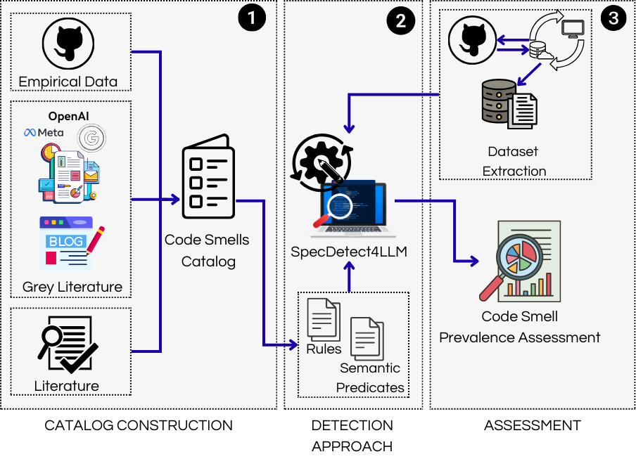

# LLM integration Code Smells — Replication Package

> Companion materials for **specifying**, **detecting**, and **measuring the prevalence** of *LLM integration code smells*.

---

## How to use: 

- [Command Line](/Detection/docs/usage.md) 
- [Web-app](Detection/docs/docker.md) 

## 1) `Catalog_Construction`

This folder contains the **formal specification** of each LLM code smell, including:

-**Smell_Extraction**, all the procedures and values extracted to create the code smell catalog.

and, for each code smell:
- **Name & Intent**
- **Context**
- **Problem**
- **Solution**
- **Effect on Software Quality**
- **Minimal Example (bad → good)**
- **Sources/References**

> Use these files to understand the semantics, rationale, and expected fixes for each code smell.

---

## 2) `Detection`

This folder provides:
- **SpecDetect4LLM**, the extended version of SpecDetect4AI with the **new detection rules** for LLM integration

---

## 3) `Prevalence`

This folder provides:
- The **dataset** used in our study
-**Results** (JSON)
- **Extracted metrics** (CSV/Parquet)
- Generated **charts/figures** (PNG)

